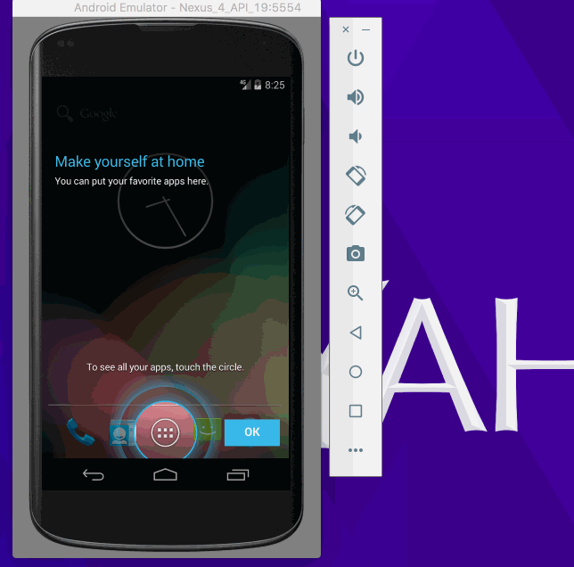
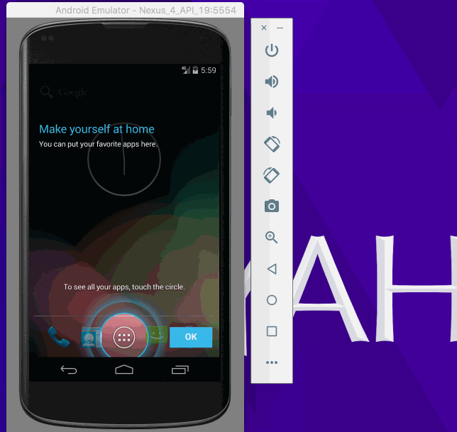

# Flixster
A read-only movie listing app using the Movie Database API.

This is an Android application for displaying the latest box office movies using the [The Movie Database API](https://api.themoviedb.org/3/movie/now_playing?api_key=a07e22bc18f5cb106bfe4cc1f83ad8ed/). See [The Movie Database API documentation](http://docs.themoviedb.apiary.io/) on our cliffnotes for a step-by-step tutorial.

Time spent: 20 hours spent in total

Completed user stories:

 * [x] User can view a list of movies (title, poster image, and overview) currently playing in theaters from the Movie Database API.
     * [x] Displays a nice default placeholder graphic for each image during loading (read more about Picasso)
     * [x] User can pull-to-refresh the popular stream with SwipeRefreshLayout
 * [x] Lists should be fully optimized for performance with the ViewHolder pattern.
 * [x] Views should be responsive for both landscape/portrait mode.
     * [x] In portrait mode, the poster image, title, and movie overview is shown.
     * [x] In landscape mode, the rotated layout should use the backdrop image instead and show the title and movie overview to the right of it.
 
Optional enhancements: 

 * [x] Use Styles and Themes to keep your layout files clean of view styles. (1 point)
 * [x] Improve the user interface through styling and coloring (1 to 5 points depending on the difficulty of UI improvements)
 * [ ] For popular movies (i.e. a movie voted for more than 5 stars), the full backdrop image is displayed. Otherwise, a poster image, the movie title, and overview is listed. Use Heterogenous ListViews and use different ViewHolder layout files for popular movies and less popular ones. (2 points)
 * [ ] Expose details of movie (ratings using RatingBar, popularity, and synopsis) in a separate activity. (3 points)
 * [ ] Stretch: Allow video posts to be played in full-screen using the YouTubePlayerView (2 points)
     * [ ] When clicking on a popular movie (i.e. a movie voted for more than 5 stars) the video should be played immediately.
     * [ ] Less popular videos rely on the details page which should show an image preview that can initiate playing a YouTube video.
     * [ ] Use the videos API to get trailer videos.
 * [ ] Stretch: Add a play icon overlay to popular movies to indicate that the movie can be played (1 point).
 * [ ] Stretch: Leverage the data binding support module to bind data into one or more activity layout templates.
 * [ ] Stretch: Switch to using retrolambda expressions to cleanup event handling blocks. (1 point)
 * [ ] Stretch: Apply the popular ButterKnife annotation library to reduce view boilerplate. (1 point)
 * [x] Stretch: Add a rounded corners for the images using the Picasso transformations. (1 point)
 * [ ] Stretch: Replace android-async-http network client with the popular OkHttp networking library for all TheMovieDB API calls. (1 points)
 * [ ] Stretch: Replace all icon drawables and other static image assets with vector drawables where appropriate. (1 points)

Notes:
  * [Full assignment spec](http://courses.codepath.com/courses/android_fast_track/unit/1#!assignment)

ToDo:
  * [My Notes:](ToDo.md)

Walkthrough of all user stories:

Walkthrough of required user stories:

GIF created with [LiceCap](http://www.cockos.com/licecap/).

